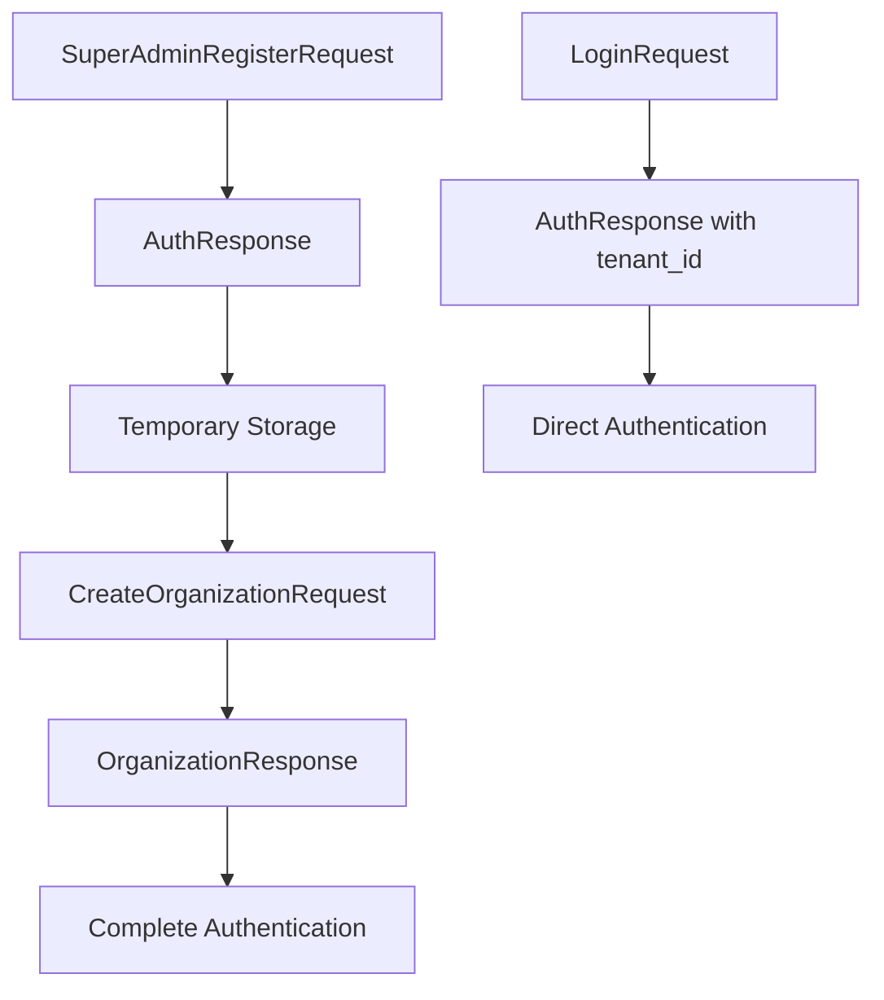

# Data Models Documentation

## Overview
Data models represent the structure of requests, responses, and entities used throughout the authentication system.

## Request Models

### 1. SuperAdminRegisterRequest

**File**: `lib/features/auth/data/models/super_admin_register_request.dart`

**Purpose**: Step 1 - Super admin registration data

```dart
class SuperAdminRegisterRequest {
  final String name;
  final String email;
  final String password;

  SuperAdminRegisterRequest({
    required this.name,
    required this.email,
    required this.password,
  });

  Map<String, dynamic> toJson() => {
    'name': name,
    'email': email,
    'password': password,
  };
}
```

**API Endpoint**: `POST /auth/register`

**Validation Requirements**:
- Name: Required, non-empty
- Email: Valid email format
- Password: Minimum 6 characters

### 2. CreateOrganizationRequest

**File**: `lib/features/auth/data/models/create_organization_request.dart`

**Purpose**: Step 2 - Organization creation data

```dart
class CreateOrganizationRequest {
  final String name;        // Organization name
  final String code;        // Organization code (uppercase)
  final String description; // Organization description
  final String role;        // Always "Super Admin"
  final String email;       // From Step 1
  final String password;    // From Step 1

  Map<String, dynamic> toJson() => {
    'name': name,
    'code': code,
    'description': description,
    'role': role,
    'email': email,
    'password': password,
  };
}
```

**API Endpoint**: `POST /organizations`

**Validation Requirements**:
- Name: Required, non-empty
- Code: Required, alphanumeric, uppercase
- Description: Required, minimum 10 characters
- Role: Fixed as "Super Admin"
- Email/Password: From temporary storage

### 3. LoginRequest

**File**: `lib/features/auth/data/models/login_request.dart`

**Purpose**: Step 3 - User login data

```dart
class LoginRequest {
  final String email;
  final String password;

  Map<String, dynamic> toJson() => {
    'email': email,
    'password': password,
  };
}
```

**API Endpoint**: `POST /auth/login`

**Validation Requirements**:
- Email: Valid email format
- Password: Minimum 6 characters

### 4. Additional Request Models

#### ForgotPasswordRequest
```dart
class ForgotPasswordRequest {
  final String email;
}
```

#### ResetPasswordRequest
```dart
class ResetPasswordRequest {
  final String token;
  final String password;
  final String confirmPassword;
}
```

#### VerifyEmailRequest
```dart
class VerifyEmailRequest {
  final String token;
}
```

## Response Models

### 1. AuthResponse

**File**: `lib/features/auth/data/models/auth_response.dart`

**Purpose**: Standard authentication response from auth service

```dart
class AuthResponse {
  final String accessToken;   // JWT access token
  final String refreshToken;  // JWT refresh token
  final UserModel user;       // User data

  factory AuthResponse.fromJson(Map<String, dynamic> json) => AuthResponse(
    accessToken: json['accessToken'] ?? '',
    refreshToken: json['refreshToken'] ?? '',
    user: UserModel.fromJson(json['user'] ?? {}),
  );
}
```

**API Response Format**:
```json
{
  "success": true,
  "message": "Login successful",
  "data": {
    "accessToken": "eyJhbGciOiJIUzI1NiIs...",
    "refreshToken": "eyJhbGciOiJIUzI1NiIs...",
    "user": {
      "id": "user_uuid",
      "email": "user@example.com",
      "name": "User Name",
      "role": "Super Admin",
      "emailVerified": true
    }
  }
}
```

### 2. OrganizationResponse

**File**: `lib/features/auth/data/models/organization_response.dart`

**Purpose**: Organization creation response from main service

```dart
class OrganizationResponse {
  final String tenantId;            // Critical for multi-tenant access
  final OrganizationData organization; // Organization details

  factory OrganizationResponse.fromJson(Map<String, dynamic> json) => 
    OrganizationResponse(
      tenantId: json['tenant_id'] ?? '',
      organization: OrganizationData.fromJson(json['organization'] ?? {}),
    );
}

class OrganizationData {
  final String id;
  final String name;
  final String code;
  final String description;
}
```

**API Response Format**:
```json
{
  "success": true,
  "message": "Organization created successfully",
  "data": {
    "tenant_id": "tenant_uuid_here",
    "organization": {
      "id": "org_id",
      "name": "ACME Corp",
      "code": "ACME",
      "description": "Software development company"
    }
  }
}
```

## Entity Models

### 1. UserModel

**File**: `lib/features/auth/data/models/user_model.dart`

**Purpose**: User data representation with serialization

```dart
class UserModel {
  final String id;
  final String email;
  final String name;
  final String? role;
  final bool emailVerified;
  final DateTime? createdAt;
  final DateTime? updatedAt;

  UserModel({
    required this.id,
    required this.email,
    required this.name,
    this.role,
    required this.emailVerified,
    this.createdAt,
    this.updatedAt,
  });

  factory UserModel.fromJson(Map<String, dynamic> json) => UserModel(
    id: json['id'] ?? '',
    email: json['email'] ?? '',
    name: json['name'] ?? '',
    role: json['role'],
    emailVerified: json['emailVerified'] ?? false,
    createdAt: json['createdAt'] != null 
        ? DateTime.parse(json['createdAt']) 
        : null,
    updatedAt: json['updatedAt'] != null 
        ? DateTime.parse(json['updatedAt']) 
        : null,
  );

  UserModel copyWith({
    String? id,
    String? email,
    String? name,
    String? role,
    bool? emailVerified,
    DateTime? createdAt,
    DateTime? updatedAt,
  }) => UserModel(
    id: id ?? this.id,
    email: email ?? this.email,
    name: name ?? this.name,
    role: role ?? this.role,
    emailVerified: emailVerified ?? this.emailVerified,
    createdAt: createdAt ?? this.createdAt,
    updatedAt: updatedAt ?? this.updatedAt,
  );
}
```

### 2. UserEntity (Domain Layer)

**File**: `lib/features/auth/domain/entities/user_entity.dart`

**Purpose**: Clean architecture entity representation

```dart
class UserEntity {
  final String id;
  final String email;
  final String name;
  final String? role;
  final bool emailVerified;
  final DateTime? createdAt;
  final DateTime? updatedAt;

  // Equality and hashCode implementation
  @override
  bool operator ==(Object other) {
    if (identical(this, other)) return true;
    return other is UserEntity &&
        other.id == id &&
        other.email == email &&
        other.name == name &&
        other.role == role &&
        other.emailVerified == emailVerified;
  }
}
```

## Model Relationships

### 3-Step Flow Data Flow



### Data Persistence

1. **Step 1 → Step 2**: Temporary storage in AuthService
2. **Step 2 → Complete**: Permanent storage in JwtTokenManager
3. **Login**: Direct to permanent storage

## Serialization Patterns

### Standard Pattern
```dart
// All models follow this pattern
class ModelName {
  // Properties
  
  factory ModelName.fromJson(Map<String, dynamic> json) {
    // Deserialization with null safety
    return ModelName(
      field: json['field'] ?? defaultValue,
    );
  }
  
  Map<String, dynamic> toJson() {
    // Serialization
    return {
      'field': field,
    };
  }
}
```

### Null Safety Considerations
- All JSON parsing includes null checks with defaults
- Optional fields use nullable types (`String?`)
- Date parsing wrapped in null checks
- Empty object fallbacks: `json['user'] ?? {}`

## Validation Integration

### Form Validation
Models work with form validation:
```dart
validator: (value) {
  if (value == null || value.isEmpty) {
    return 'Field is required';
  }
  // Additional validation based on model requirements
  return null;
}
```

### API Validation
Backend validation errors are handled through:
- `ApiResponse.errors` field for field-specific errors
- `ApiResponse.message` for general errors

## Testing Considerations

### Model Testing
```dart
test('should serialize/deserialize correctly', () {
  final model = SuperAdminRegisterRequest(
    name: 'Test User',
    email: 'test@example.com', 
    password: 'password123',
  );
  
  final json = model.toJson();
  final fromJson = SuperAdminRegisterRequest.fromJson(json);
  
  expect(fromJson.name, equals(model.name));
});
```

### Null Safety Testing
```dart
test('should handle null values gracefully', () {
  final user = UserModel.fromJson({'id': 'test'});
  expect(user.email, equals(''));
  expect(user.role, isNull);
});
```

## Performance Considerations

- **Lightweight Models**: Minimal processing in constructors
- **Lazy Loading**: DateTime parsing only when needed
- **Immutable Objects**: All models are immutable for thread safety
- **Memory Efficient**: No unnecessary object creation in serialization
